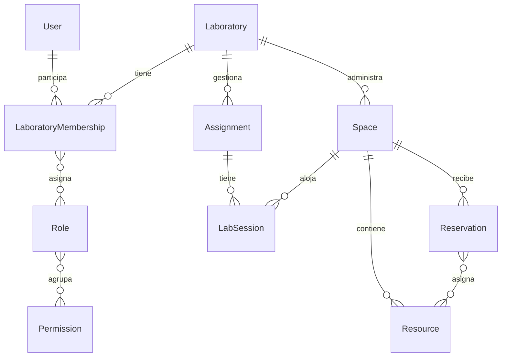

# Arquitectura de Labora

## Estado y fuentes

Base técnica inicial; no es el MVP funcional del SRS. Labora es el nombre de la aplicación en esta sesión; PoliLabs se conserva como nombre del repositorio. La denominación definitiva es una decisión de producto pendiente.

Fuente de requisitos: [SRS V3 completo](../srs/PoliLabs-SRS.tex), fechado el 13 de agosto de 2026. La ruta solicitada `docs/srs/labora-srs.tex` no existe. Por decisión explícita del responsable del proyecto, el original y su PDF se conservan sin cambios en `docs/srs/`; Linux distingue mayúsculas. Ver ADR 0007.

Consultar el [índice de ADR](../decisions/README.md). «Aceptada» describe una decisión autorizada, no una función implementada. El SRS llama «propuesta» a parte del stack; las instrucciones de esta sesión ratifican TypeScript, Next.js, PostgreSQL, Drizzle, monolito modular y servicios compartidos. Los detalles cloud requieren evaluación futura.

## Organización y dependencias

```text
src/
  app/                         # Presentación y composición Next.js
  config/                      # Validación de configuración
  modules/
    academic/ attendance/ usage/ spatial/ reservations/ inventory/
    maintenance/ incidents/ documents/ knowledge/ notifications/
    identity/ audit/            # Responsabilidades documentadas; sin lógica todavía
    <module>/domain/            # Reglas puras; identity tiene un README inicial
    <module>/application/       # Servicios; identity tiene un README inicial
  infrastructure/database/     # Cliente, punto de entrada de esquema y documentación
scripts/                       # Comprobación local de conexión
tests/                         # Pruebas automatizadas
docs/architecture/             # Arquitectura vigente y pendientes
docs/decisions/                # Historial de decisiones
```

La web invocará servicios de aplicación; estos validarán identidad, permisos, entradas, relaciones e invariantes, y coordinarán transacciones y adaptadores. El dominio no dependerá de React, HTTP, Drizzle o IA. Los adaptadores de persistencia pueden depender del dominio; las interfaces se introducirán solo cuando tengan una responsabilidad concreta. La composición del servidor conectará servicios y adaptadores.

Giussepe será otra interfaz: herramienta → mismo servicio de aplicación → autorización y revalidación → persistencia. No tendrá acceso SQL directo ni privilegios adicionales. No hay código de IA en esta base.

Se prefiere `infrastructure/database` a duplicar `core/database` del esquema sugerido en §11.2. Identidad y auditoría tienen un único lugar bajo `modules`. La estructura de carpetas es una convención inicial ajustable, no una nueva capa técnica.

## Dominios y relaciones del SRS

| Dominio       | Entidades y relaciones propuestas                                                                                                  | Requisitos principales    |
| ------------- | ---------------------------------------------------------------------------------------------------------------------------------- | ------------------------- |
| Academic      | Práctica → sesiones; alumno ↔ sesión por asistencia; grupos y periodos                                                             | RF2–6, RB1, §17           |
| Spatial       | Space → planos, recursos y ubicaciones; Location → padre opcional; elementos del plano referencian recursos/ubicaciones            | RF7–9, RF17–19, §12       |
| Reservations  | Reservación → recursos mediante asociación; serie → ocurrencias; bloqueos independientes; referencias opcionales a práctica/sesión | RF10–14, RB5–9, §13       |
| Inventory     | Ítem → existencias y movimientos por ubicación opcional; préstamos temporales; unidades variables                                  | RF15–22, RB2–4, RB10, §14 |
| Maintenance   | Recurso → bitácoras; materiales utilizados vinculados a consumos                                                                   | RF25–27, §15              |
| Incidents     | Reporte → recurso/espacio/sesión conocidos; seguimiento y resolución                                                               | RF28–29, RB11–12, §16     |
| Knowledge     | Documento → metadatos, permisos, clave de objeto y asociaciones (Documents I en `modules/documents`)                               | RF24, §18                 |
| Notifications | Usuario → notificaciones, preferencias, entregas y suscripciones                                                                   | RF30–33, §19              |
| Identity      | Usuario interno, perfil alumno opcional, roles compuestos por permisos e identidades externas futuras                              | RF1, §§23–24              |
| Audit         | Actor, entidad, acción, origen e historial relevante                                                                               | RNF9, §25                 |
| AI            | Interfaz de herramientas; no fuente de datos operativos                                                                            | RF36–38, §§20–21          |

Las tablas de §22 son sugeridas, no un esquema aprobado para migrar íntegro. Los recursos físicos individualizados no se deben duplicar como otra identidad independiente de inventario sin definir su relación. Grupos, periodos, organizaciones y membresías no están completamente especificados por la lista de tablas.

## Laboratorios y membresías aprobados

El [ADR 0006](../decisions/0006-laboratory-scope.md) define la unidad operativa `Laboratory` separada del espacio físico `Space`. Cada laboratorio administra sus espacios, recursos y prácticas; las sesiones y reservaciones mantienen relaciones coherentes dentro de un solo laboratorio. `Organization` se pospone.



Una sola membresía por usuario y laboratorio admite varios roles: una persona puede ser alumno y ayudante simultáneamente. Los permisos se resuelven únicamente con los roles de esa membresía activa, y siempre se someten a las restricciones del caso de uso. La participación académica y los horarios de servicio son independientes; no se activan permisos automáticamente por horario ni se permiten intervenciones indebidas en registros académicos propios.

Los servicios deben verificar actor, membresía, permiso y relaciones; acotar lecturas y escrituras, incluidos listados y exportaciones; y revalidar operaciones diferidas. El mismo límite aplica al asistente, a documentos y a cachés. Administrar recursos no implica gestionar membresías ni acceder a otros laboratorios. Las políticas específicas de delegación y registros propios se definirán antes de implementar esas operaciones.

El primer corte de este modelo está implementado en tablas y servicios de aplicación. El catálogo inicial de roles es común; sus asignaciones tienen alcance local. Existen tres permisos mínimos de identidad/laboratorio; Spatial I añade `space.read` y `space.manage`, y Spatial II añade `location.read`, `location.manage`, `resource.read` y `resource.manage`. Ver [Identity y Authorization](identity-authorization.md) y [Catálogo espacial](spatial-catalog.md).

## Aceptado, implementado y posterior

**Aceptado:** monolito modular, stack indicado, PostgreSQL autoritativo, servicios reutilizables, separación autenticación/autorización, control por permisos, trazabilidad útil y adaptadores externos. También se aceptan Laboratory separado de Space, membresías con varios roles y postergación de Organization. Ver ADR 0001–0006. El ADR 0009 acepta la implementación actual de Reservations I: elegibilidad de Space/Resource activos para este corte, lectura/cancelación propias del creador y serialización por Space en READ COMMITTED.

**Implementado:** App Router con una página informativa responsiva y un [shell autenticado](authenticated-shell.md); TypeScript estricto; Tailwind; configuración de lint, formato y pruebas; validación de URL de base de datos sin revelar secretos; cliente Drizzle de servidor; Compose para PostgreSQL local con la imagen `postgres:17-alpine`, volumen persistente, healthcheck y publicación en `127.0.0.1:5433`; script de lectura para comprobar conexión. Better Auth 1.7.6 está integrado con correo/contraseña, login, logout y cambio de contraseña; el registro público y borrado físico siguen deshabilitados. Las sesiones duran 12 horas sin renovación. Identity implementa laboratorios, membresías activables con varios roles, listado acotado al actor, autorización por slug mediante `AuthorizationService`, asignación acotada de roles y bootstrap controlado. Spatial I implementa `Space`; Spatial II implementa `Location` jerárquica y `Resource` físico individual con ubicación opcional. Las lecturas se acotan por laboratorio, las escrituras reautorizan dentro de transacciones y PostgreSQL protege relaciones del mismo espacio y ciclos. Reservations I añade disponibilidad, creación individual, detalle/listado propios y cancelación lógica mediante servicios reutilizables, con protección PostgreSQL contra conflictos concurrentes. Trece migraciones versionadas cubren estos incrementos, incluidos Academic I, Attendance I, Usage I, Incidents I, Maintenance I, Documents I y Loans I. Reservations II integra el flujo web individual en el shell mediante páginas servidor, Server Actions y un adaptador que reutiliza los cinco servicios existentes. Inventory I implementa catálogo por Laboratory, una existencia principal opcional por Location y movimientos/eventos trazables, servicios transaccionales y búsqueda/alta/detalle/edición/desactivación web; ver [Inventory I](inventory.md), [validación](inventory-validation.md) y ADR 0010 (Aceptada). Ver [Reservations I y II](reservations.md) y ADR 0009 (Aceptada). Ver la [validación de autenticación](authentication-spike.md), el [primer flujo de autorización](identity-authorization.md) y el [catálogo espacial](spatial-catalog.md).

**Posterior:** recuperación de contraseña y proveedor de correo, administración de cuentas/membresías, auditoría persistente, clasificación y reservabilidad configurable de espacios/recursos, planos y representación gráfica, horarios y calendarios avanzados de reservaciones, relación definitiva Resource/Inventory, adaptador S3 de documentos, PWA, push, reportes académicos/asistencia/reservaciones/uso y Giussepe. AWS y Bedrock no están aprovisionados ni conectados. La interfaz actual usa Tailwind sin añadir una biblioteca de componentes.

## Integridad y seguridad que guiarán los módulos

RNF4–6 y §30 exigen restricciones, claves foráneas y transacciones. Una consulta de disponibilidad no garantiza una escritura posterior: la protección debe cubrir la operación concurrente completa. Se decidirán bloqueos, restricciones de exclusión, aislamiento e idempotencia al modelar reservaciones/inventario; no se afirma que esos controles ya existan.

Cada servicio recibirá contexto autenticado y verificará permisos y pertenencia al laboratorio. El proveedor de autenticación no sustituye estos controles. No se deben exponer operaciones sin autorización por tener una UI provisional. Los efectos de notificaciones se desacoplan mediante eventos (§19); la entrega durable y el mecanismo de reintento se decidirán antes de implementarlos. No hay bus ni cola en esta etapa.

## Decisiones pendientes y consecuencias

- **Extensión del alcance aprobado:** Laboratory, membresías, Space, Location y Resource ya tienen un primer corte. Quedan por diseñar clasificación y reservabilidad de Space/Resource, planos, la relación definitiva Resource/Inventory, la matriz de permisos de los demás módulos y las reglas de delegación más allá del rol inicial. Organization y operaciones compartidas entre laboratorios se posponen.
- **Identidad:** Better Auth, UUID, bootstrap local, UI de acceso, logout y cambio de contraseña están implementados conforme al ADR 0008. El registro público y el borrado físico permanecen deshabilitados. Quedan por implementar recuperación, adaptador de correo, administración y retención de auditoría. No asumir AWS ni integración IPN.
- **Atomicidad de mantenimiento y consumo:** resuelta en [ADR 0015](../decisions/0015-maintenance-logs.md): bitácora, estado y consumos se confirman en una sola transacción; no hay estados parciales ni compensaciones.
- **PWA:** §3.1 y RNF2 la incluyen, pero §34.2 la sitúa en V1.5. Se aplaza según el alcance explícito de esta sesión; confirmar la aceptación de cada entrega futura.
- **Modelo incompleto:** §16 permite incidentes asociados a espacios, pero el ejemplo de campos en §22.2 no incluye `space_id`; grupos, periodos, asignación de roles y vínculo activo/ítem requieren modelado. No copiar el listado como contrato completo.
- **Tiempo y recurrencia:** Reservations I define instantes con offset, timestamptz, [inicio, fin), inicio futuro y cancelación propia antes del inicio. Estas políticas están aprobadas en ADR 0009 (Aceptada). America/Mexico_City es la política inicial de interfaz/despliegue, sin restringir permanentemente futuros laboratorios a esa zona horaria; recurrencia, excepciones y configuración por laboratorio siguen pendientes.
- **AWS:** S3 y destino AWS están acordados, Bedrock previsto; topología, región, costos, SES/CloudWatch/CDK y posible AgentCore se evaluarán al desplegar. §35 pide validar adopción final. Sin recursos pagos en esta sesión.
- **Edición del SRS:** numeración de flujos 27.x bajo §28 y referencias V1/V3 requieren revisión editorial futura. No se han corregido ni movido los originales.

## Siguiente incremento recomendado

Seleccionar explícitamente el siguiente flujo funcional. Spatial II no autoriza automáticamente FloorPlan, reservaciones ni inventario. Cualquier módulo nuevo deberá introducir sólo sus permisos y restricciones concretas reutilizando `AuthorizationService`. La selección corresponde al responsable del proyecto.

El flujo individual Reservations I fue seleccionado explícitamente e implementado en backend. Reservations II fue seleccionado explícitamente e integra la UI individual. Cualquier ampliación requiere otro flujo aprobado; ver [alcance y validación](reservations.md).

Inventory I fue seleccionado explícitamente e implementa el flujo aprobado de catálogo y existencias por cantidad. Préstamos, activos individualizados y relación Resource/Inventory, múltiples saldos, transferencias y representación gráfica requieren incrementos posteriores; ver [Inventory I](inventory.md) y ADR 0010.

## Academic I seleccionado e implementado

El responsable seleccionó Academic I como siguiente flujo tras Inventory I: prácticas, sesiones y participantes previstos. Incluye dominio, servicios autorizados, relaciones del mismo laboratorio protegidas por PostgreSQL, eventos transaccionales y UI. Ver [alcance y validación](academic.md) y [ADR 0011 (Aceptada)](../decisions/0011-academic-sessions.md) para las políticas concretas aprobadas explícitamente el 6 de octubre de 2026. El responsable seleccionó posteriormente Attendance I y después Usage I; ambos se documentan por separado. Sesión, reservación, asistencia y uso real conservan significados distintos.

## Attendance I y Usage I

Attendance I completa la constancia académica con deep-link estable de Location, confirmación propia, padrón y correcciones trazables. Usage I registra por separado el inicio/fin efectivo de Resource bajo sesión abierta o reserva propia vigente. Ver [Attendance](attendance.md), [Usage](usage.md) y [validación](attendance-usage-validation.md). Dos migraciones aditivas versionadas incorporan cuatro tablas y seis permisos; no se generan usos/asistencias automáticamente. ADR 0012 y 0013 están Aceptadas mediante aprobación explícita del responsable el 7 de octubre de 2026. Incidents I se implementa como siguiente corte autorizado.

## Incidents I

Reportes sobre Resource, Space o LabSession, con Usage propio opcional y contexto espacial conservado al reportar. Seguimiento open → in_review → resolved, notas/eventos y consulta autorizada de usos previos sin atribuir responsabilidad. No requiere clase o reservación ni produce bloqueos o mantenimiento. Ver [arquitectura](incidents.md), [validación](incidents-validation.md) y [ADR 0014 — Aceptada](../decisions/0014-operational-incidents.md).

## Maintenance I

Bitácora inmutable por Resource y estado operativo `operational`/`in_maintenance`/`out_of_service` en `resources`, modificable sólo mediante una entrada. Materiales consumidos como movimientos `consumption` de Inventory en la misma transacción. RB5: recursos no operativos se rechazan en nuevas reservaciones de recursos y nuevos usos; lo existente no se cancela. Vínculo opcional a incidencia del mismo recurso. Ver [arquitectura](maintenance.md), [validación](maintenance-validation.md) y [ADR 0015 — Aceptada](../decisions/0015-maintenance-logs.md).

## Documents I

Metadatos en `documents` y binarios fuera de la base mediante el puerto `ObjectStorage`, con un único adaptador de disco local (`DOCUMENT_STORAGE_DIR`); S3 no está implementado ni aprovisionado. Manuales por Resource y evidencia añadida a entradas de mantenimiento sin editarlas. Tipo verificado por firma (PDF/PNG/JPEG/WebP), 10 MB, subida por route handler con `Origin` y corte de stream, descarga sólo por ruta autorizada, archivado lógico, compensación y barrido de huérfanos. Evidencia de incidencias y eliminación de EXIF pendientes. Ver [arquitectura](documents.md), [validación](documents-validation.md) y [ADR 0016 — Aceptada](../decisions/0016-documents-object-storage.md).

## Loans I

Préstamo y devolución temporales de herramientas reutilizables a miembros activos del laboratorio, con devoluciones parciales, fecha compromiso opcional, vencidos calculados al consultar y sesión académica opcional. La disponibilidad es existencia − pendiente activo; el préstamo no es consumo (RB4). Una devolución con daño o pérdida genera el movimiento de inventario vinculado en la misma transacción. Un trigger diferido nuevo garantiza existencia ≥ prestado sin redefinir funciones de Inventory I. Una migración aditiva (`0012_loans_i.sql` en `feat/loans-i`) añade dos tablas y los permisos `inventory.loan` e `inventory.loan.read`. Ver [arquitectura](loans.md), [validación](loans-validation.md) y [ADR 0017 — Aceptada](../decisions/0017-tool-loans.md).

## Reports I

Seis reportes operativos de §32 exportables en CSV y PDF: stock e historial de inventario, préstamos y devoluciones, mantenimiento por recurso, incidencias y recursos fuera de servicio o próximos a mantenimiento. Módulo de lectura `src/modules/reports` que consulta tablas de otros módulos sin escribir en ellas, en una transacción REPEATABLE READ autorizada con el permiso de lectura de cada reporte. Generación síncrona por route handler, sin almacenamiento ni migraciones; límites de 5000 filas y 366 días; PDF con `pdf-lib` 1.17.1. Ver [arquitectura](reports.md), [validación](reports-validation.md) y [ADR 0018 — Propuesta](../decisions/0018-exportable-reports.md).

## Pruebas end-to-end

Playwright con Chromium en escritorio y móvil, contra la base `_test` y un laboratorio sintético por spec. Cubre Maintenance, Documents, Loans y Reports; las guías manuales anteriores quedan por migrar. Ver [pruebas end-to-end](e2e.md).
